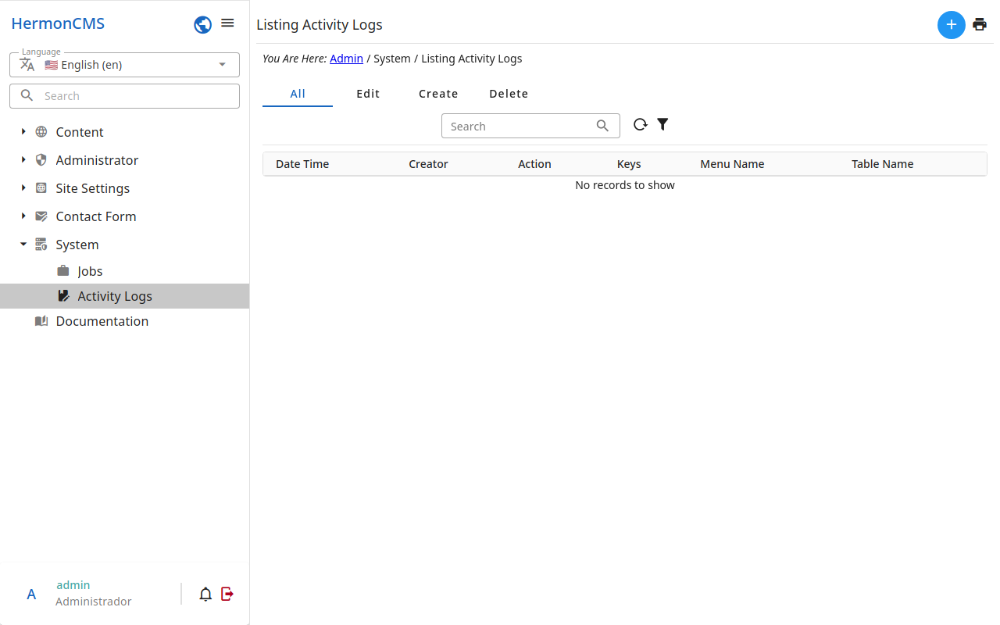

# Activity logs

Every change made in the admin is written here: **who** did it, **what** was
done (created, edited, deleted, published…), to **which record**, and
**when**.

- Use the filters at the top to find the changes of a user, of a kind of
  record, or of a period.
- Open a log to see the record as it was and what changed in it.

A record's own changes are also shown from its detail: see
.
