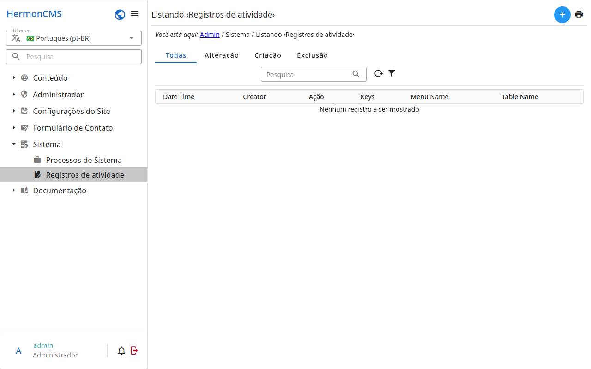

# Registros de atividades

Toda alteração feita no admin fica registrada aqui: **quem** a fez, **o que**
foi feito (criado, editado, excluído, publicado…), em **qual registro** e
**quando**.

- Use os filtros no topo para achar as alterações de um usuário, de um tipo
  de registro ou de um período.
- Abra um registro de atividade para ver o registro como estava e o que
  mudou nele.

As alterações de um registro também aparecem no detalhe dele: veja
.
