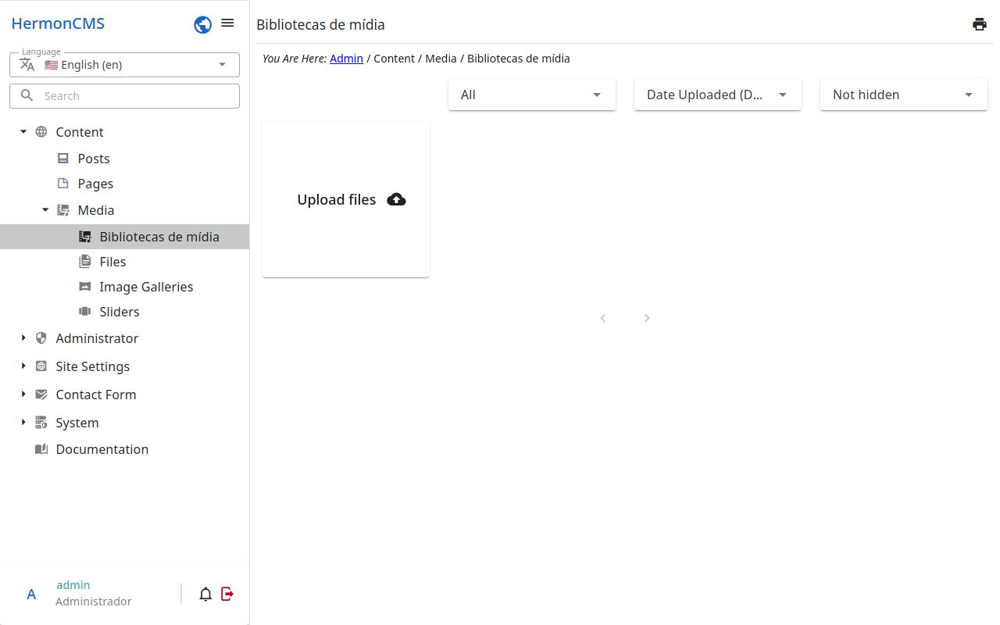

# Media libraries

The images and files used by the site: what is uploaded here is chosen in
the fields of images and files of the other records (the cover of a page, the
pictures of a gallery…).

- **Upload**: drag the files into the area at the top, or choose them.
- **Folders** keep the files in order; a file may be moved between them.
- An image may be **cropped** in the sizes the site uses, from its detail.
- A file in use by a record cannot be deleted until it is replaced there.
