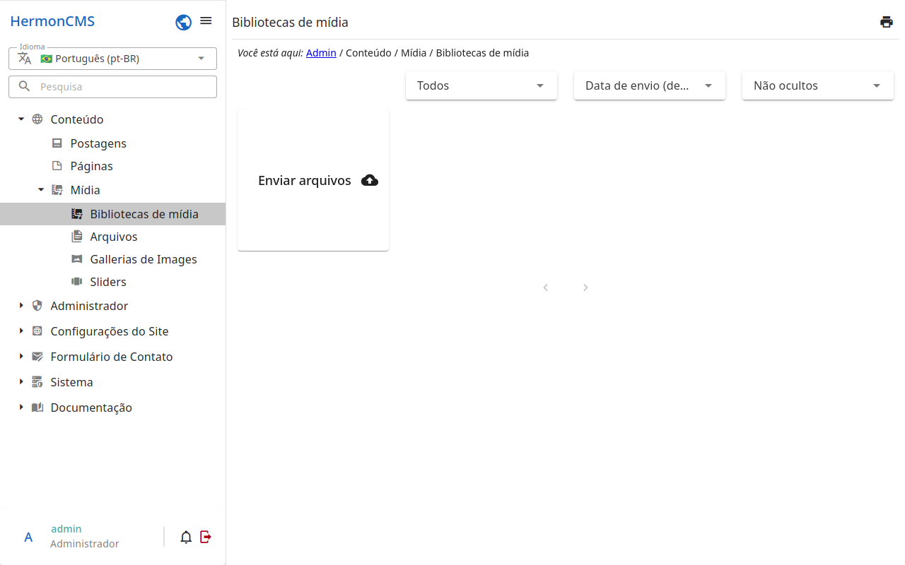

# Bibliotecas de mídia

As imagens e os arquivos que o site usa: o que é enviado aqui é escolhido nos
campos de imagens e de arquivos dos outros registros (a capa de uma página,
as fotos de uma galeria…).

- **Carregar arquivos**: arraste os arquivos para a área no topo, ou
  escolha-os.
- **Pastas** mantêm os arquivos em ordem; um arquivo pode ser movido entre
  elas.
- Uma imagem pode ser **cortada** nos tamanhos que o site usa, no detalhe
  dela.
- Um arquivo em uso por um registro não pode ser excluído até ser trocado
  lá.
