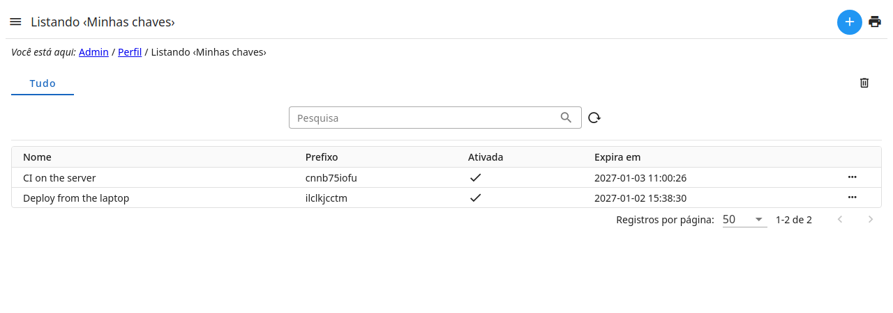
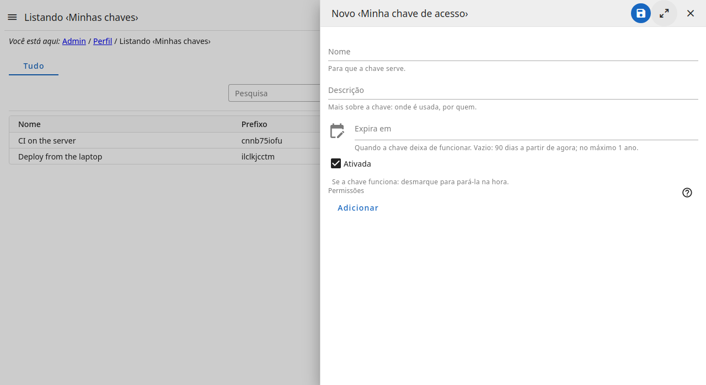
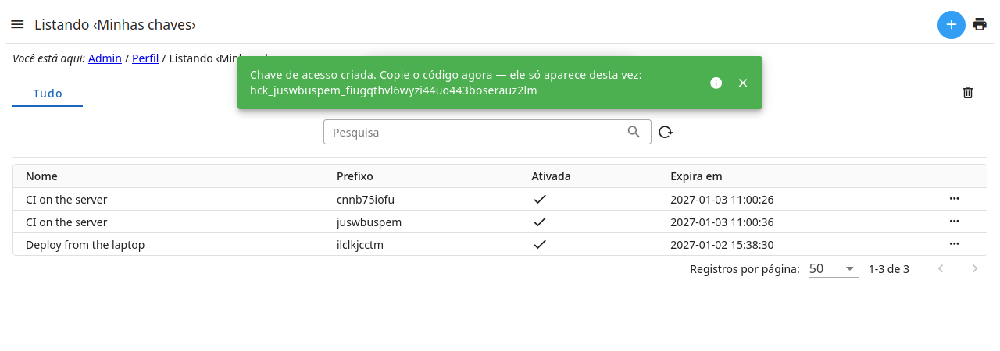
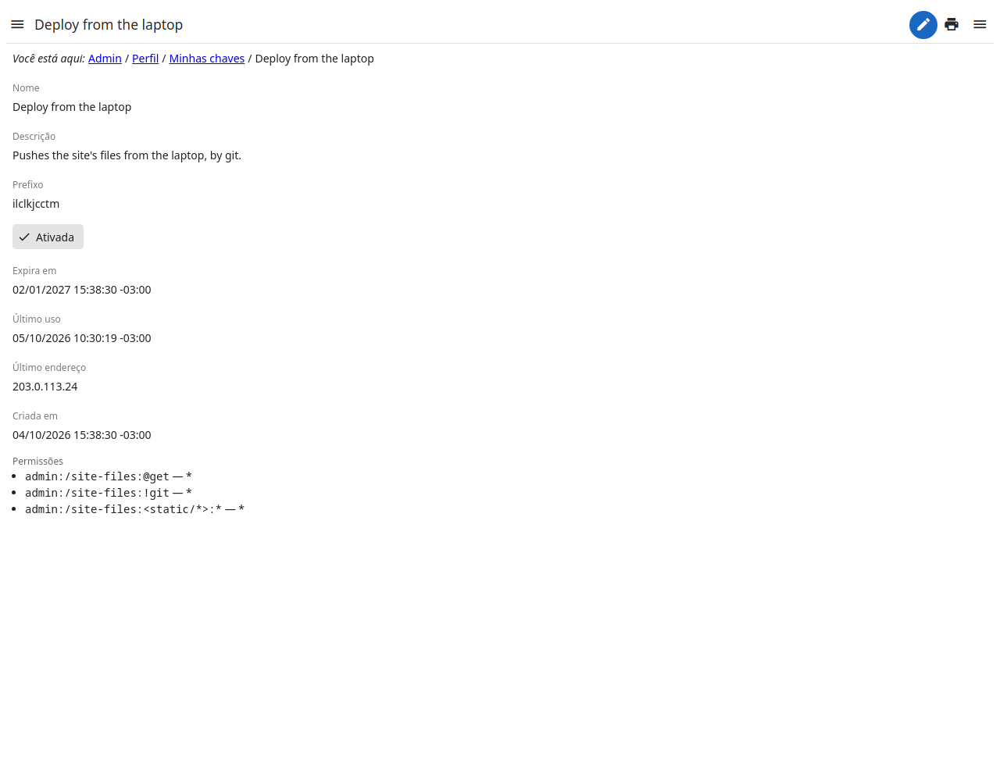
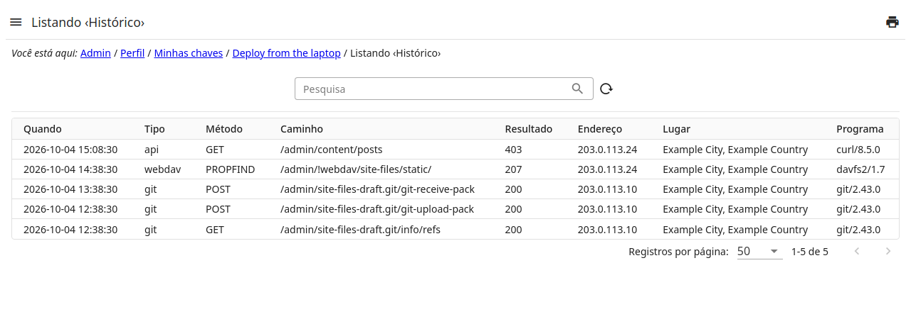

# Minhas chaves

Uma **chave de acesso** é um código com que uma automação — o **git**, um
programa de **WebDAV**, um script — entra em seu nome, sem senha e sem
sessão: cada requisição traz a chave.



## Criar uma chave



1. Em **Minhas chaves**, crie uma chave: dê um **nome** (para que ela serve),
   a **validade** (90 dias se ficar vazia; no máximo 1 ano) e as
   **permissões**.
2. Ao salvar, o **código** aparece **uma única vez**:
   `hck_…`. Copie e guarde num lugar seguro. Ele não é guardado em lugar
   nenhum — só um resumo (hash) dele —; perdeu, crie outra chave.
   

3. Para parar uma chave na hora: desmarque **Ativada**, ou exclua a chave.

## As permissões

As permissões de uma chave **só restringem**: um pedido feito pela chave é
permitido quando **você pode** e **a chave permite**. Uma chave nunca dá
mais do que você tem — e, sem nenhuma permissão, não faz nada.

Elas se escrevem como as dos papéis (veja
), só que só
permitem:

| Recursos | A chave pode |
| --- | --- |
| `admin:*` | tudo o que você pode |
| `admin:/site-files:!git`, `admin:/site-files:@get` e as ações dos arquivos | usar os arquivos do site pelo git |
| `admin:/site-files:<static/*>:!edit` | só mudar os arquivos de `static/` |



Uma chave nunca cria nem altera chaves — nem as suas.

## Usar

- **git:** a senha é o código (o usuário pode ser qualquer um):

  ```
  git clone https://<o-site>/admin/site-files-draft.git
  # usuário: seu login; senha: hck_…
  ```

- **WebDAV:** o mesmo — usuário e, como senha, o código.
- **Um script:** o cabeçalho `Authorization: Bearer <código>`:

  ```
  curl -H "Authorization: Bearer hck_…" https://<o-site>/admin/…
  ```

## O histórico



Cada pedido feito pela chave fica no **Histórico** dela: quando, de onde
(endereço e lugar), por qual programa, o quê (git, webdav, api; o caminho) e
o resultado. E aparece também no seu **log de acesso** (as sessões do seu
perfil), como "Chave de acesso: *nome*" — uma linha a cada meia hora por
endereço e programa, não uma por pedido.
