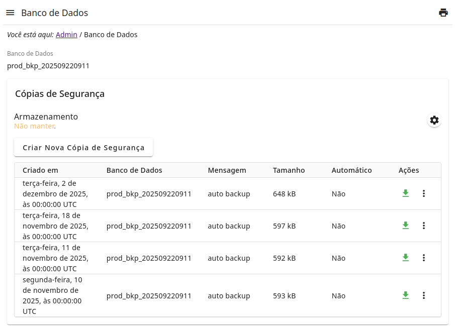
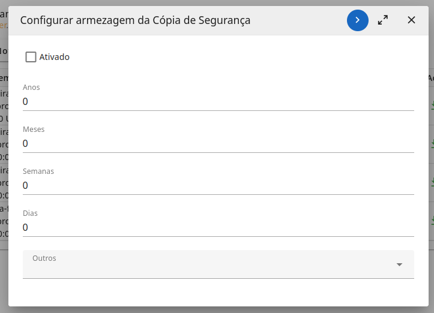
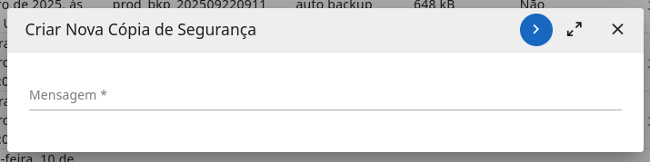

# db-tools

This module provides admin interface to manage database backup tool.

Features:

- Manual backup creation with custom message;
- Auto backup creator (using Cron rules);
- List backups;
- Remove backups;
- Download backup files;
- Configure backup history preservation; 

<figure>
    
    <figcaption>Sample Screen</figcaption>
</figure>

<figure>
    
    <figcaption>Configure Backup Preservation</figcaption>
</figure>

<figure>
    
    <figcaption>Manual backup creation with custom message</figcaption>
</figure>