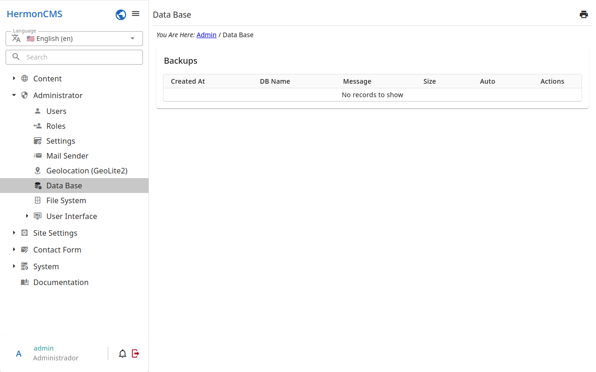

# Database

The backups of the database of the site.

- **Create backup** makes a copy of the database now, with a note.
- The **automatic backup** makes one a day.
- **Persistence** says how long the backups are kept: so many days, weeks,
  months, years — the older ones are removed.
- A backup may be downloaded, or removed.
