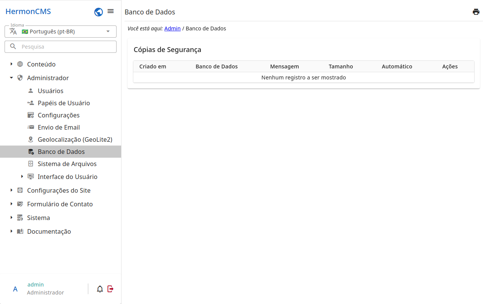

# Banco de dados

As cópias de segurança do banco de dados do site.

- **Criar Nova Cópia de Segurança** faz uma cópia do banco de dados agora,
  com uma nota.
- A **cópia automática** faz uma por dia.
- A **persistência** diz por quanto tempo as cópias são mantidas: tantos
  dias, semanas, meses, anos — as mais antigas são removidas.
- Uma cópia pode ser baixada ou removida.
