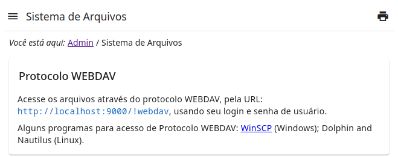

# FS Tools

This module provides access to File System.

Features:

- Authentication using user and password credentials;
- WEBDAV access protocol.

<figure>
    
    <figcaption>File System page</figcaption>
</figure>