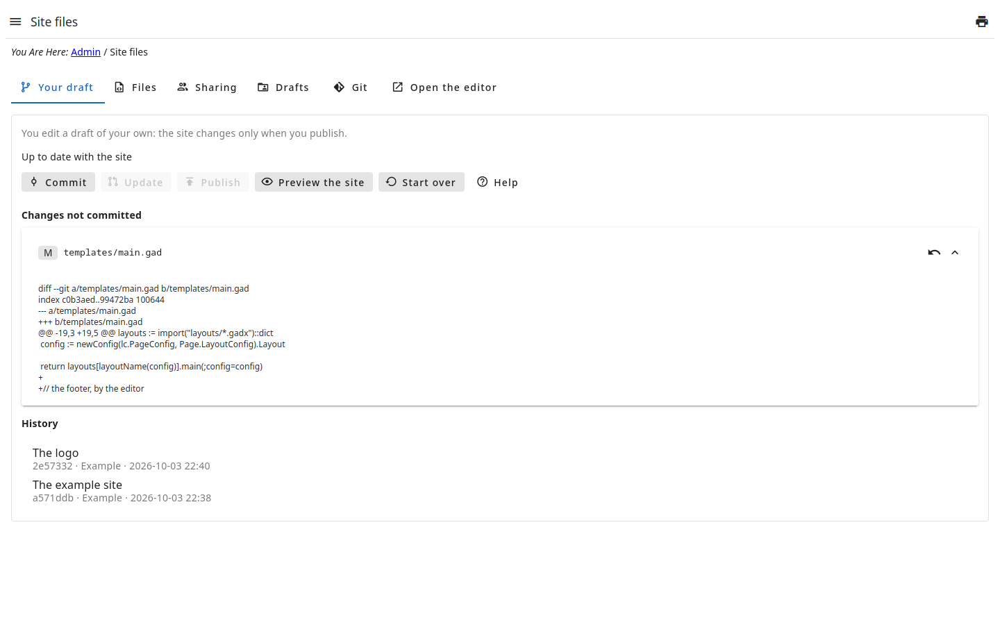
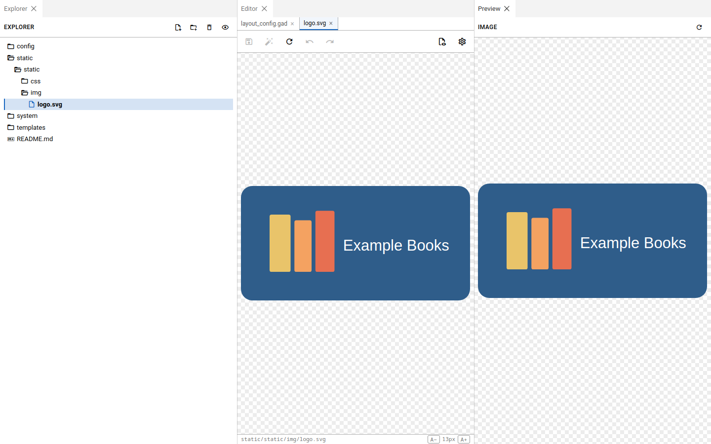

# Edit in the draft

Each person edits a **draft** of their own: a copy of the files of the site,
made the first time they open the page. What you save changes your draft
only — the site and the drafts of the others stay as they are.

- **Files**, on the right, is the editor: the tree of the files at its left,
  each file open in a tab. Save with the tab's button or Ctrl+S.
- From the buttons above the tree: create files and folders; **upload** files
  from the computer (or drop them on the tree) and **import from a URL** —
  images and fonts too, as they are —; **rename**, **move** to another folder
  and **delete** the open file. Each is shown only to whoever may do it (see
  the step **Permissions**).
- The editor formats and checks the `.gad`/`.gadx` files; it does not run
  code.
- **Changes not committed**, on the left, lists each file changed since the
  last commit; open one to see what changed. **Discard** drops its changes.
- **Start over** drops the whole draft (the commits not published too): a new
  one is made from the site.

The files are in folders: `templates/` (the pages, the layouts, the
components), `static/` (styles, scripts, images) and `config/` (the options
of the layouts).

## The editor in a tab of its own

**Open the editor** opens the editor in a tab of the browser, with more room.
It has three panels: **Explorer** (the tree of the files), **Editor** (the
files open, one per tab) and **Preview**, which shows the open file as its
type is:

- a `.gad`, `.gadt` or `.gadx` file: the **documentation** written in its
  comments (`/*** … ***/` for the file, `/** … **/` before a declaration) —
  **Generate** generates the whole documentation;
- a **Markdown** file (`.md`), rendered; an **HTML** one, rendered without
  running its scripts;
- an **image**: the image.

An image (png, jpg, gif, webp, svg…) opens as an image, whole and not
stretched, in the editor and in the Preview — not as text:

## By WebDAV

The same draft can be opened from a computer, as a network drive, by the
admin's **WebDAV** (its address is in **Administrator → File System**), in
the folder `site-files`: edit the files in the program you like. The same
permissions as in the admin hold — seeing asks `@get`; creating, editing,
renaming, moving and deleting each its own, of each path (see the step
**Permissions**) —, and the `.git` folder is not shown. Committing and publishing
stay here, on this page.
