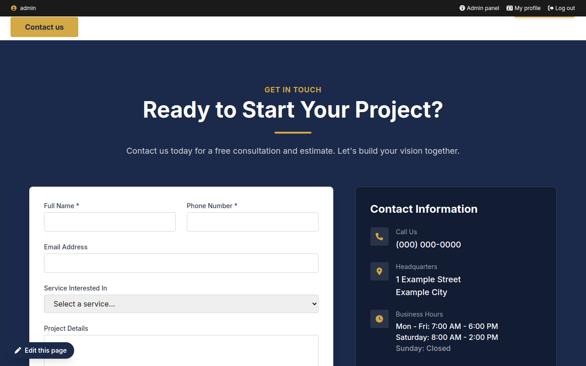

# Preview

**Preview the site** opens, in a new tab, the site as your draft makes it:
its templates, styles and images, with the site's real content (the pages and
posts published).

- Browse at will: the links stay in the preview (`/admin/site-preview/…`).
- Only you see your draft; the visitors still see the site.
- Saved a file? Reload the page of the preview.
