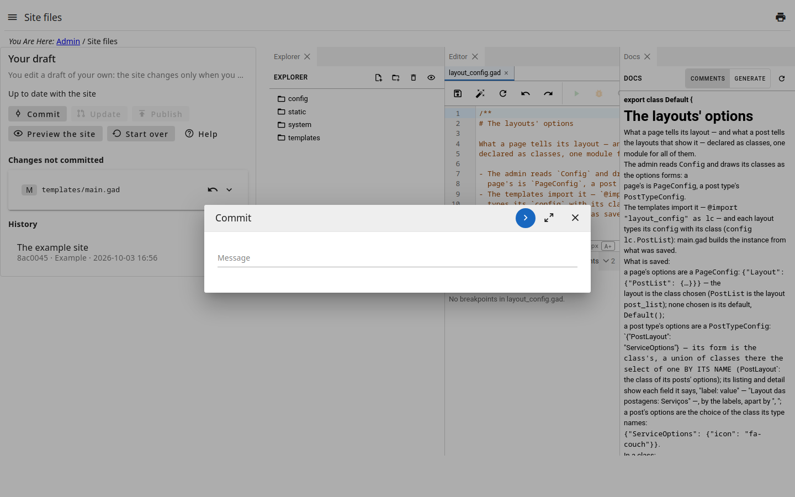

# Commit

A **commit** records the changes of the draft, with a **message** saying what
they are ("Fix the footer", "New services page"). It carries your name and
e-mail and goes into the **History**.

- A commit does not change the site yet: it stays in the draft until you
  publish.
- Before the commit, the draft is checked: the index page of each language is
  made with it. If that fails — a template that does not compile, say —,
  nothing is recorded and the error is shown, with the file and the line.
- With no changes, there is nothing to record.
