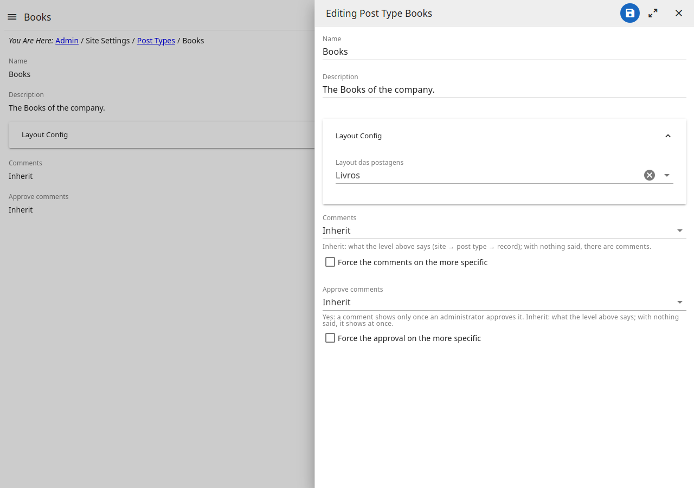
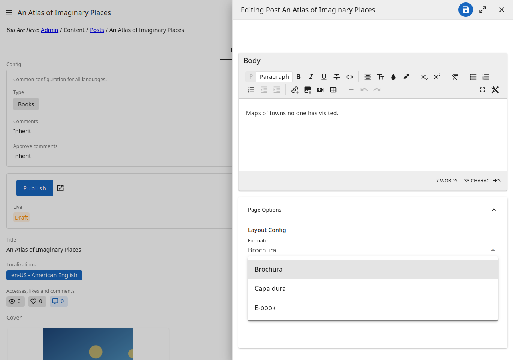

# Options of the layouts

The options a page, a post type or a post shows in the admin are written in
`config/layout_config.gad`: each set of options is a **class**, each option a
**field** of it. Saving and publishing the file changes the forms of the
admin — no restart.

```gad
class Banner {
    [label="Title", hint="Shown over the image"]
    title str
    [label="Height"]
    height int = 400
}
```

- `[label="…", hint="…"]` before a field: what the form calls it, and the line
  under it.
- `name type`: `str` (text), `int`, `bool` (a switch), `float`; `= value` is
  its default; `name?` may be left empty.

## Whose options each class is

The file ends in the classes the admin reads:

- **Pages** — `PageConfig`: its `Layout` is the choice of the page's layout,
  each layout a class with its options (`Layout Default | PostList | …`).
- **Post types** — `PostTypeConfig`: its `PostLayout` lists the classes a
  type may choose **for its posts** (`PostLayout? ServiceOptions |
  PortfolioOptions`).
- **Posts** — have no class of their own here: **a post's options are the
  class its post type chose**. In **Post Types**, the type's options choose
  the layout of its posts; then every post of that type shows those fields in
  its options. A type that chose none: its posts have no options.



And a post of that type, in **Page Options → Layout Config**: the fields of
the layout its type chose — here `BookOptions`, its `format` a select of its
`options`:



So, to give the posts of a type new options, add the fields to the class the
type chose (or write a new class, add it to `PostLayout` and choose it in the
type). Changing the class a type chose leaves the options its posts saved
under the old one out of their form.

## A choice among values: a select

A field that holds **one of a closed list** of values is a select. Give it
the values, and what the form shows for each, with `options`:

```gad
[ordered]
class Banner {
    [label="Alignment", options=(;left="On the left", center="Centered", right="On the right")]
    align str
    [label="Columns", options=[[2, "Two"], [3, "Three"], [4, "Four"]]]
    columns int = 3
    [label="Style", options=["light", "dark"]]
    style? str
}
```

`options` is written in one of three ways, in the order the select shows:

| Written | Each item | Example |
|---|---|---|
| a key-value array `(;…)` | value `=` label | `(;left="On the left")` |
| an array of pairs | `[value, label]` | `[[2, "Two"]]` |
| an array of values | the value is its label | `["light", "dark"]` |

- What is **saved** is the **value** (`left`, `3`); the label is only shown.
  Changing a label is safe; changing a value leaves what was saved with the
  old one out of the list.
- The form accepts only a value of the list. A field with no `?` must be
  chosen; with `?` it may be left empty.
- It works with any type: `columns int` keeps saving a number.
- On a list of values (`tags []str`), each item is a select of the options.

An `enum` declared in the file is also a select — its members are the values,
each shown by its name:

```gad
enum Align {
    left
    center
    right
}

class Banner {
    align Align
}
```

Use `options` when the values need labels of their own, or are numbers.

## When the file is wrong

A value given twice, a pair without its label (`[["a"]]`), `options` that is
neither of the three forms, or `options` on a field that is a group of fields
(`interface {…}`) is an error: the admin shows it in place of those options
until the file is fixed. Check the form before publishing.
