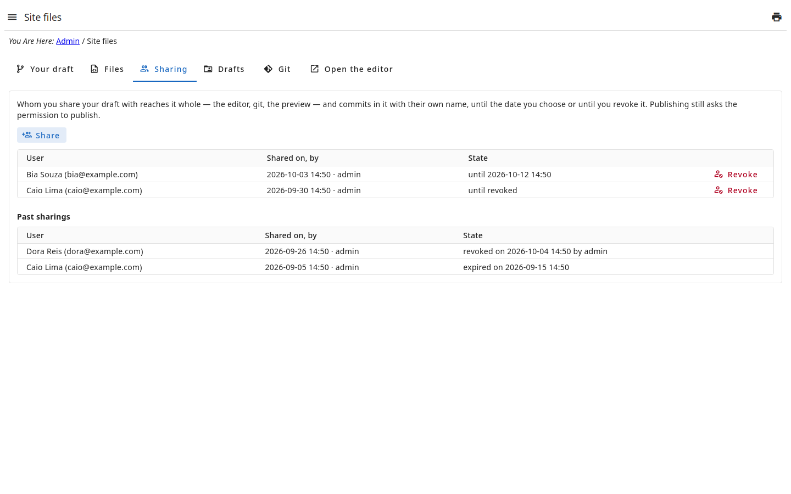
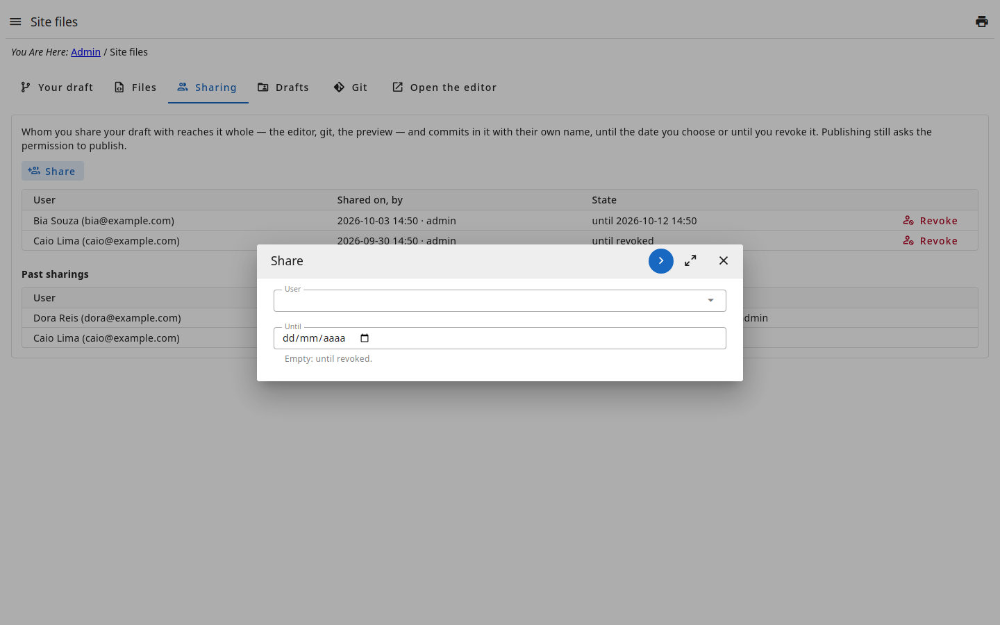
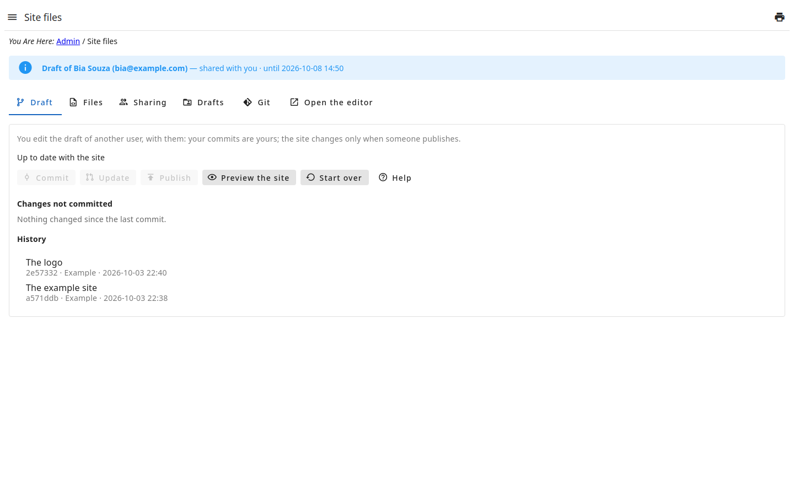
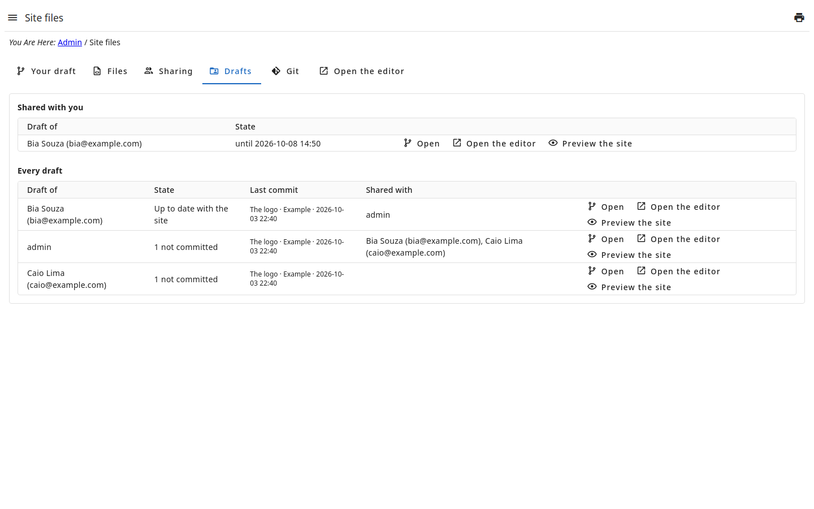

# Work together

Your draft can be **shared** with other users: they edit it with you and test
it before someone publishes. Who publishes is still who may publish.

## Share

In the tab **Sharing** of the page :

- **Share** chooses the user and, if you like, **until when** — empty is until
  you revoke it. On that date the access ends by itself.
- The list shows whom the draft is shared with, since when and by whom;
  **Revoke** ends it at once.
- The sharings that ended (revoked or expired) stay listed, with when and by
  whom: who had access is recorded.

Sharing asks the permission `!share`; a draft is shared by its owner only.

## What whoever receives it reaches

The whole draft, at its address — `…/site-files/u/<the owner's key>` —, listed
in the tab **Drafts** of whoever receives it:

- the page, saying the draft is another user's;
- the **editor** (the tabs Files and Open the editor);
- the **preview** of the site as the draft makes it;
- **git**: `…/site-files-drafts/<the owner's key>.git` (see the step
  **By git**; the address is in the tab **Git** of the draft).

Each one's permissions still hold: sharing opens the door, it gives no more
than the role gives. **Start over** and sharing the draft stay with its owner.
As soon as the access ends, the editor, the preview and git of whoever had it
stop answering.

## Who did what

Each commit is **its maker's**, with their git credentials (see
), in another's draft too. A commit
of the page also says:

| In the commit | What |
| --- | --- |
| `Co-authored-by:` | the other users who changed its files since the last commit |
| `Site-User:` | who made it: their login and their key, at the site's address |
| `Committed-Via:` | that it was made by the admin panel |

## Every draft

Whoever has the permission `!drafts` — the **Administrator** — sees, in the
tab **Drafts**, each user's draft: how it stands, its last commit, whom it is
shared with; opens the page, the editor and the preview of each, and revokes
any sharing.

