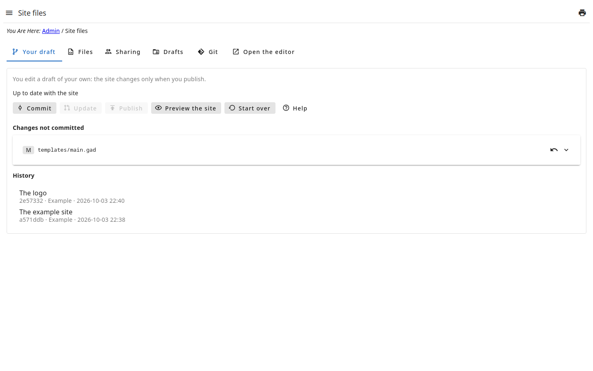
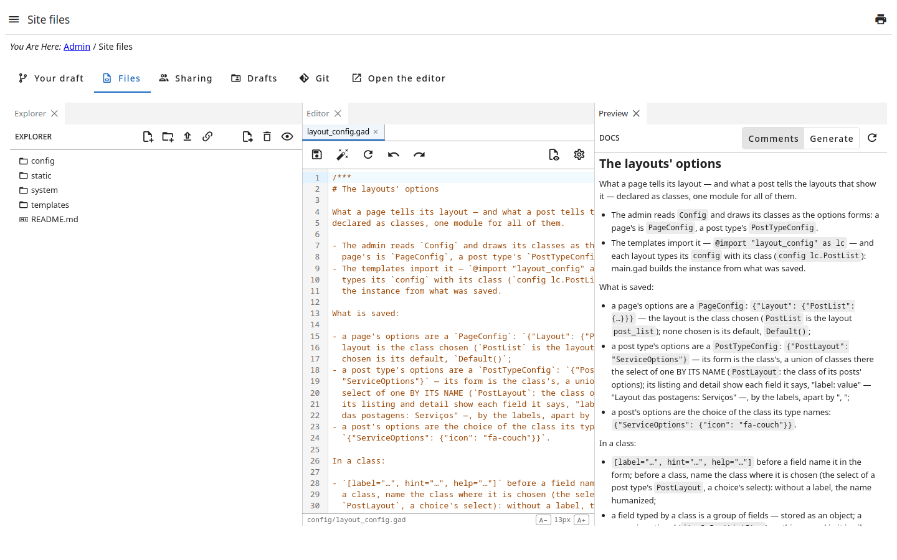

# Site files

The files the site is made of — its templates, styles, scripts and images —
edited here, in a **draft** of your own: the site changes only when you
**publish**.

Step by step, with the local development: the guide  — also the page's **Help** button.

The page has three tabs:

- **Your draft** — the first — says where it stands: commits to publish,
  commits others published that it does not have; and holds the actions
  below, the changes and the history.
- **Files** is the editor: the tree of the files, and each file open in a
  tab. Saving changes your draft only.
- **Sharing**: whom your draft is shared with, and **Share**/**Revoke** (see
  ).
- **Drafts**: the drafts of others shared with you — and, to whoever may,
  every user's.
- **Git**: your draft and the site by git — each with its address, the
  clone, the permissions it asks (✓ the ones you have, ✗ the ones you do
  not) and the hook that signs the commits (see
  ).
- **Open the editor**, at the right of the others, opens the editor in a tab
  of the browser of its own, the whole window; the page stays on the tab it
  was on. At its top, a header: the admin's logo and name, your login,
  **Admin panel** (back to the admin), **Sign out** and the button of the
  light or dark theme — the choice is kept in the browser.

In **Your draft**:

- **Changes not committed** lists each file changed since the last commit;
  open it to see what changed. **Discard** drops the changes of a file.
- **Commit** records the changes, with a message saying what they are; the
  commit carries your name.
- **Update** brings into your draft what others published: your commits go
  on top of theirs, your changes are kept.
- **Publish** puts your commits on the site.
- **Preview the site** opens the site as your draft makes it: navigate it,
  nothing of it is seen by the visitors.
- **Start over** drops your draft: a new one is made from the site.

## When it is available

- **Commit** and **Publish** check the draft first: if the site, as the
  draft makes it, shows an error — a template that does not compile —, nothing
  is committed nor published, and the error is shown.
- **Publish** needs every change committed, and the draft updated with what
  others published.
- If a file of the site was changed out of this editor, **Publish** overwrites
  nothing and says so.

## Permissions

Each action is a permission of the page: seeing it (`@get`), changing the
files of the draft (`!edit`), `!commit`, `!update`, `!publish`, `!discard`,
`!reset` and `!preview` — publishing can be given to fewer people than
editing.
