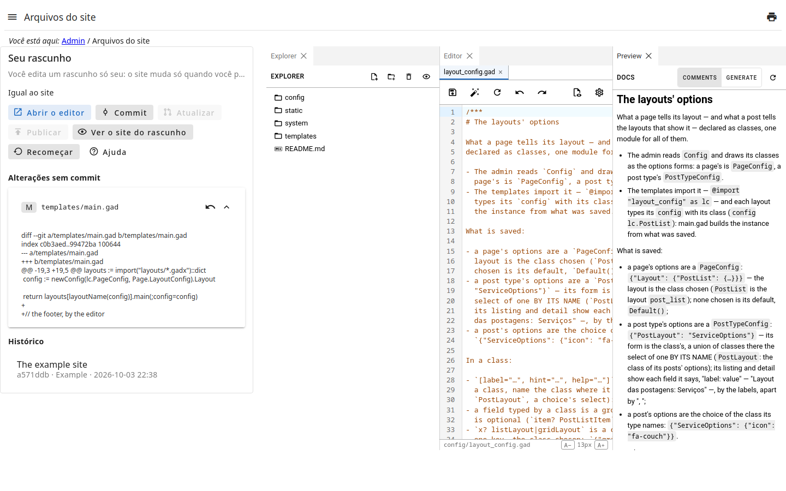
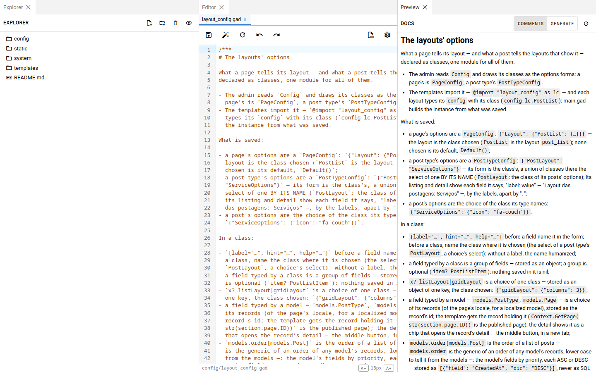
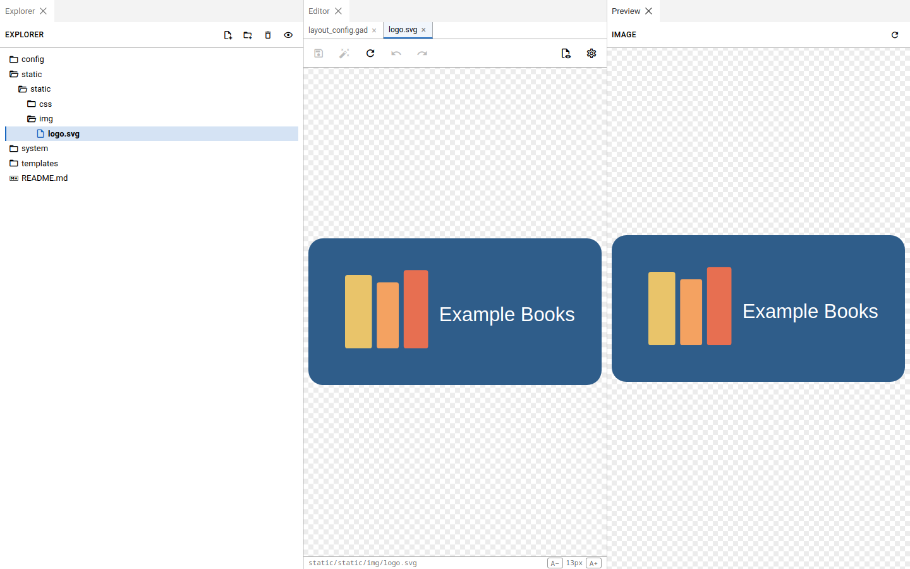

# Editar no rascunho

Cada pessoa edita um **rascunho** só seu: uma cópia dos arquivos do site,
feita na primeira vez que abre a página. O que você salva muda só o seu
rascunho — o site e os rascunhos dos outros ficam como estão.

- **Arquivos**, à direita, é o editor: a árvore dos arquivos à esquerda dele,
  cada arquivo aberto numa aba. Salve com o botão da aba ou com Ctrl+S.
- Criar, renomear e apagar arquivos e pastas: pelo menu da árvore.
- O editor formata e confere os arquivos `.gad`/`.gadx`; ele não executa
  código.
- **Alterações sem commit**, à esquerda, lista cada arquivo mudado desde o
  último commit; abra um para ver o que mudou. **Descartar** desfaz as
  alterações dele.
- **Recomeçar** descarta o rascunho inteiro (os commits não publicados
  também): um novo é feito a partir do site.

Os arquivos ficam em pastas: `templates/` (as páginas, os layouts, os
componentes), `static/` (estilos, scripts, imagens) e `config/` (as opções
dos layouts).

## O editor numa aba própria

**Abrir o editor** abre o editor numa aba do navegador, com mais espaço. Ele
tem três painéis: **Explorer** (a árvore dos arquivos), **Editor** (os
arquivos abertos, um por aba) e **Preview**, que mostra o arquivo aberto
conforme o tipo dele:

- um arquivo `.gad`, `.gadt` ou `.gadx`: a **documentação** escrita nos
  comentários dele (`/*** … ***/` para o arquivo, `/** … **/` antes de uma
  declaração) — **Generate** gera a documentação completa;
- um arquivo **Markdown** (`.md`), renderizado; um **HTML**, renderizado sem
  executar os scripts dele;
- uma **imagem**: ela mesma.

Uma imagem (png, jpg, gif, webp, svg…) abre como imagem, inteira e sem
distorcer, no editor e no Preview — não como texto:

## Pelo WebDAV

O mesmo rascunho pode ser aberto de um computador, como uma unidade de rede,
pelo **WebDAV** do admin (o endereço está em **Administrador → Sistema de
Arquivos**), na pasta `site-files`: edite os arquivos no programa que
preferir. Valem as mesmas permissões do admin — ver pede `@get`, mudar pede
`!edit` —, e a pasta `.git` não aparece. O commit e a publicação continuam
aqui, nesta página.
