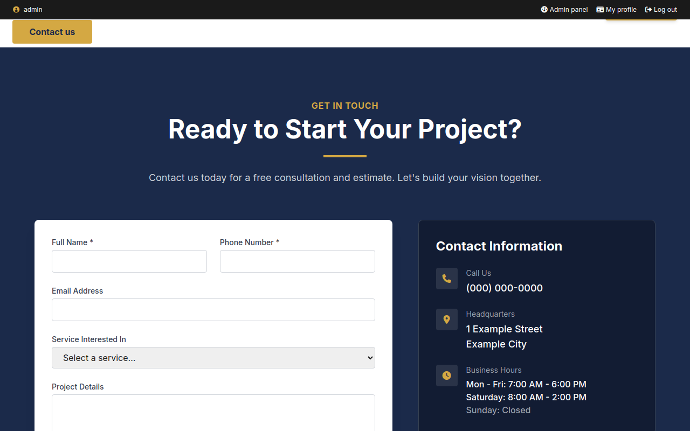

# Pré-visualizar

**Ver o site do rascunho** abre, numa aba nova, o site como o seu rascunho o
faz: os templates, os estilos e as imagens dele, com o conteúdo de verdade do
site (as páginas e os posts publicados).

- Navegue à vontade: os links continuam dentro da pré-visualização
  (`/admin/site-preview/…`).
- Só você vê o seu rascunho (e quem tiver o link do preview público); os
  visitantes continuam vendo o site.
- Salvou um arquivo? Recarregue a página da pré-visualização.

## Preview público

Para mostrar o rascunho a quem não tem conta no admin — um cliente, um
revisor —, na aba **Seu rascunho** use **Tornar o preview público**. Escolha
até quando ele vale (vazio: até você encerrar) e copie o **Link**: quem o
tiver vê o site como o seu rascunho o faz, sem login.

- O link é um endereço impossível de adivinhar (`/_preview/<token>/…`) e não é
  indexado pelos buscadores.
- Ele mostra o rascunho como está agora — também as mudanças ainda não
  commitadas.
- **Encerrar o preview público** invalida o link na hora. Tornar público de
  novo gera um link novo; o anterior para de funcionar.
- Pede a permissão `!public_preview` (além de `!preview`). Quem vê todos os
  rascunhos (`!drafts`) pode encerrar o preview público de qualquer um.
