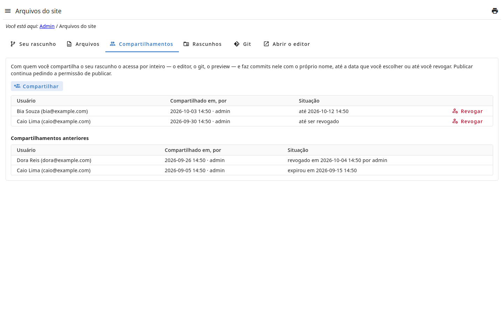
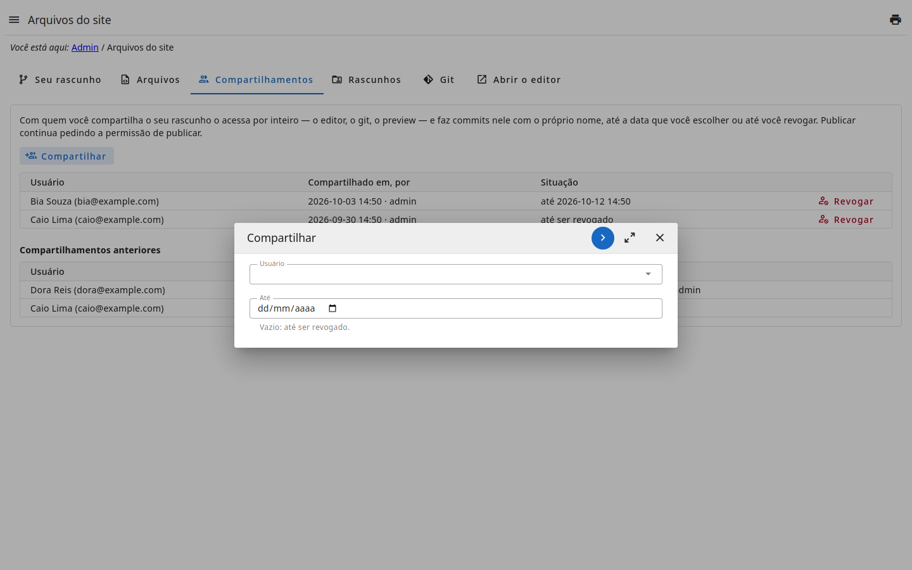
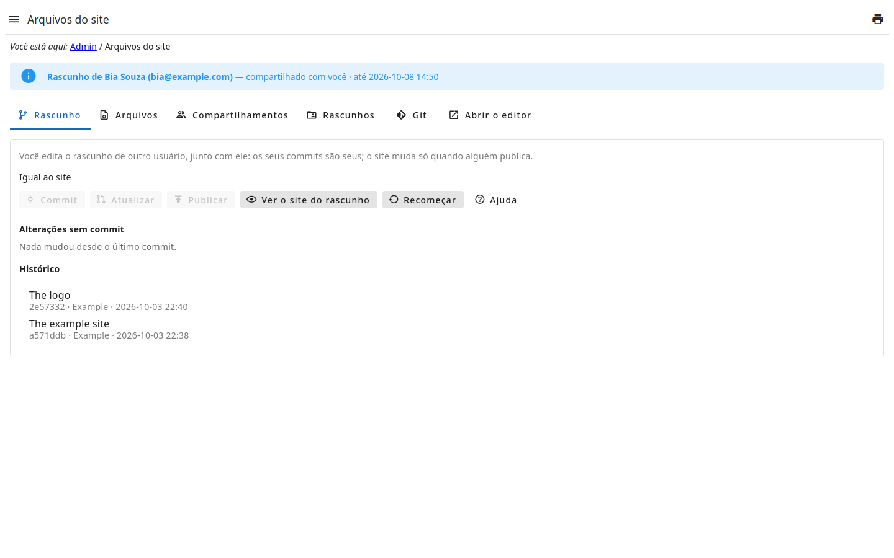
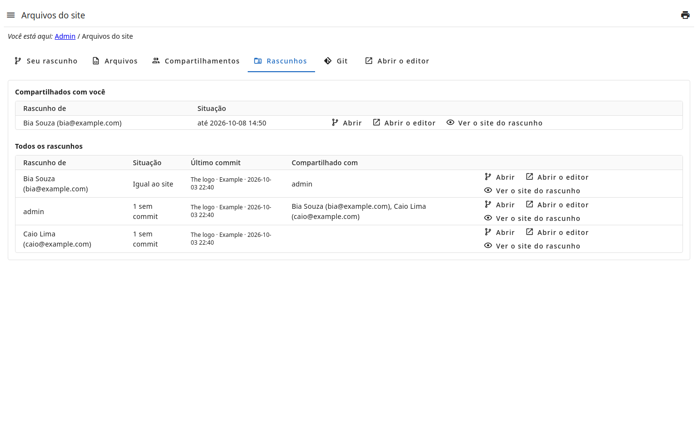

# Trabalhar em conjunto

O seu rascunho pode ser **compartilhado** com outros usuários: eles o editam
junto com você e testam antes de alguém publicar. Quem publica continua sendo
quem tem a permissão de publicar.

## Compartilhar

Na aba **Compartilhamentos** da página :

- **Compartilhar** escolhe o usuário e, se quiser, **até quando** — vazio é até
  você revogar. Na data, o acesso termina sozinho.
- A lista mostra com quem o rascunho está compartilhado, desde quando e por
  quem; **Revogar** encerra na hora.
- Os compartilhamentos que já terminaram (revogados ou expirados) continuam
  listados, com quando e por quem: quem teve acesso fica registrado.

Compartilhar pede a permissão `!share`; um rascunho é compartilhado só pelo
seu dono.

## O que quem recebe acessa

O rascunho inteiro, no endereço dele — `…/site-files/u/<a chave do dono>` —,
listado na aba **Rascunhos** de quem o recebe:

- a página, com o aviso de que o rascunho é de outro usuário;
- o **editor** (as abas Arquivos e Abrir o editor);
- o **preview** do site como o rascunho o faz;
- o **git**: `…/site-files-drafts/<a chave do dono>.git` (veja o passo
  **Pelo git**; o endereço está na aba **Git** do rascunho).

As permissões de cada um continuam valendo: compartilhar abre a porta, não dá
mais do que o papel dá. **Recomeçar** e compartilhar o rascunho ficam com o
dono. Assim que o acesso termina, o editor, o preview e o git de quem o tinha
param de responder.

## Quem fez o quê

Cada commit é de **quem o faz**, com as credenciais do git dela (veja
), mesmo no rascunho de outro. Um
commit pela página diz também:

| No commit | O quê |
| --- | --- |
| `Co-authored-by:` | os outros usuários que mudaram os arquivos dele desde o último commit |
| `Site-User:` | quem o fez: o login e a chave dele, no endereço do site |
| `Committed-Via:` | que foi feito pelo painel administrativo |

## Todos os rascunhos

Quem tem a permissão `!drafts` — o **Administrador** — vê, na aba
**Rascunhos**, o rascunho de cada usuário: como ele está, o último commit,
com quem está compartilhado; e abre a página, o editor e o preview de cada um,
e revoga qualquer compartilhamento.

