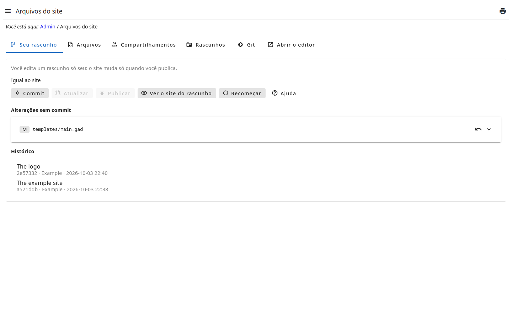
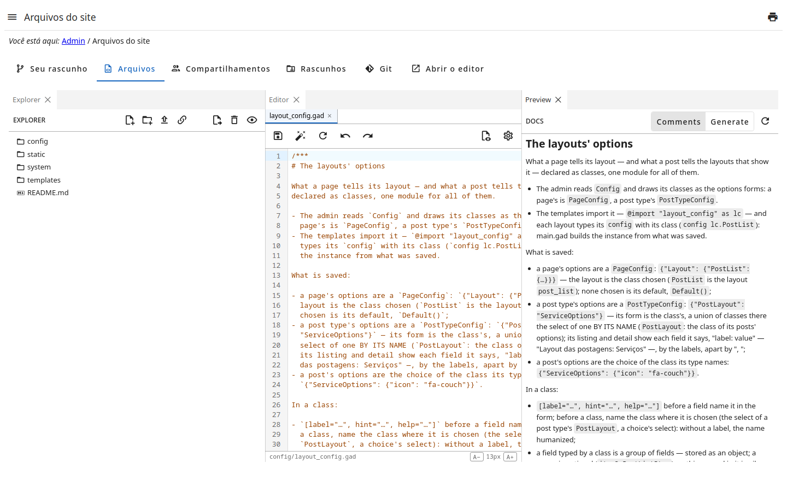

# Arquivos do site

Os arquivos de que o site é feito — templates, estilos, scripts e imagens —
editados aqui, num **rascunho** só seu: o site muda só quando você
**publica**.

Passo a passo, com o desenvolvimento local: o guia  — também o botão **Ajuda** da página.

A página tem três abas:

- **Seu rascunho** — a primeira — diz onde ele está: commits para publicar,
  commits que outros publicaram e ele não tem; e reúne as ações abaixo, as
  alterações e o histórico.
- **Arquivos** é o editor: a árvore dos arquivos, e cada arquivo aberto numa
  aba. Salvar muda só o seu rascunho.
- **Compartilhamentos**: com quem o seu rascunho está compartilhado, e
  **Compartilhar**/**Revogar** (veja ).
- **Rascunhos**: os rascunhos de outros compartilhados com você — e, a quem
  pode, o de todos os usuários.
- **Git**: o seu rascunho e o site pelo git — cada um com o endereço, o
  clone, as permissões que pede (✓ as que você tem, ✗ as que não) e o hook
  que assina os commits (veja ).
- **Abrir o editor**, à direita das outras, abre o editor numa aba do
  navegador só dele, na janela inteira; a página fica na aba em que estava.
  No alto dele, um cabeçalho: o logo e o nome do admin, o seu login,
  **Painel admin** (volta ao admin), **Sair** e o botão do tema claro ou
  escuro — a escolha fica guardada no navegador.

Em **Seu rascunho**:

- **Alterações sem commit** lista cada arquivo mudado desde o último commit;
  abra para ver o que mudou. **Descartar** desfaz as alterações de um arquivo.
- **Commit** registra as alterações, com uma mensagem dizendo o que são; o
  commit leva o seu nome.
- **Atualizar** traz para o seu rascunho o que outros publicaram: os seus
  commits vão por cima dos deles, as suas alterações ficam.
- **Publicar** põe os seus commits no site.
- **Ver o site do rascunho** abre o site como o seu rascunho o faz: navegue
  por ele; nada dele é visto pelos visitantes.
- **Recomeçar** descarta o seu rascunho: um novo é feito a partir do site.

## Quando está disponível

- **Commit** e **Publicar** conferem o rascunho antes: se o site, como o
  rascunho o faz, mostra um erro — um template que não compila —, nada é
  registrado nem publicado, e o erro aparece.
- **Publicar** pede todas as alterações com commit e o rascunho atualizado
  com o que outros publicaram.
- Se um arquivo do site foi mudado fora deste editor, **Publicar** não
  sobrescreve nada e avisa.

## Permissões

Cada ação é uma permissão da página: vê-la (`@get`), mudar os arquivos do
rascunho (`!edit`), `!commit`, `!update`, `!publish`, `!discard`, `!reset` e
`!preview` — publicar pode ser dado a menos gente que editar.
