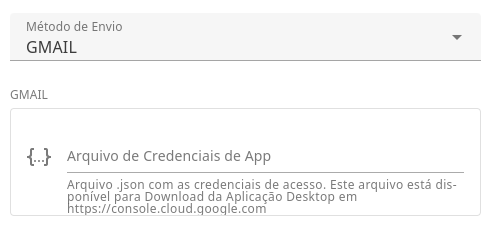
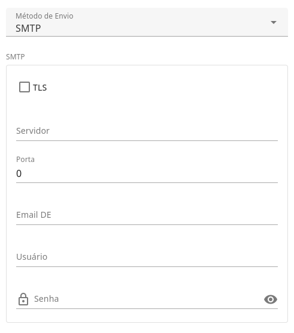
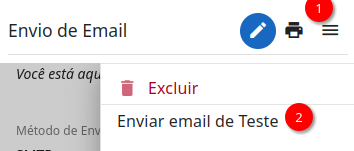
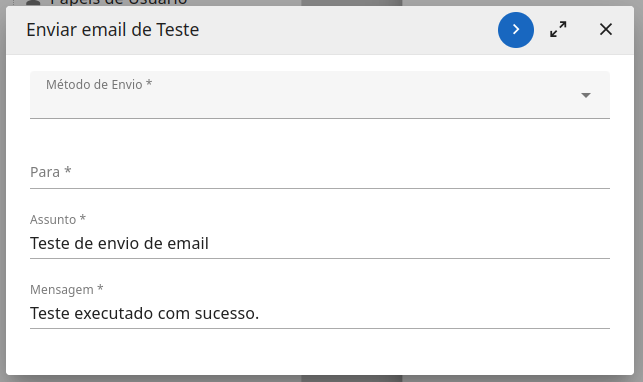

# mail-sender

This module provides mail sender tools.

Features:

- Custom message Prefix;
- Sent using GMAIL or SMTP;
- Sent mail test;

<figure>
    
    <figcaption>Settings page</figcaption>
</figure>

<figure>
    
    <figcaption>Gmail Settings</figcaption>
</figure>

<figure>
    
    <figcaption>SMTP Settings</figcaption>
</figure>

## Send Test action
<figure>
    
    <figcaption>Send Test action</figcaption>
</figure>

<figure>
    
    <figcaption>Send Test action form</figcaption>
</figure>