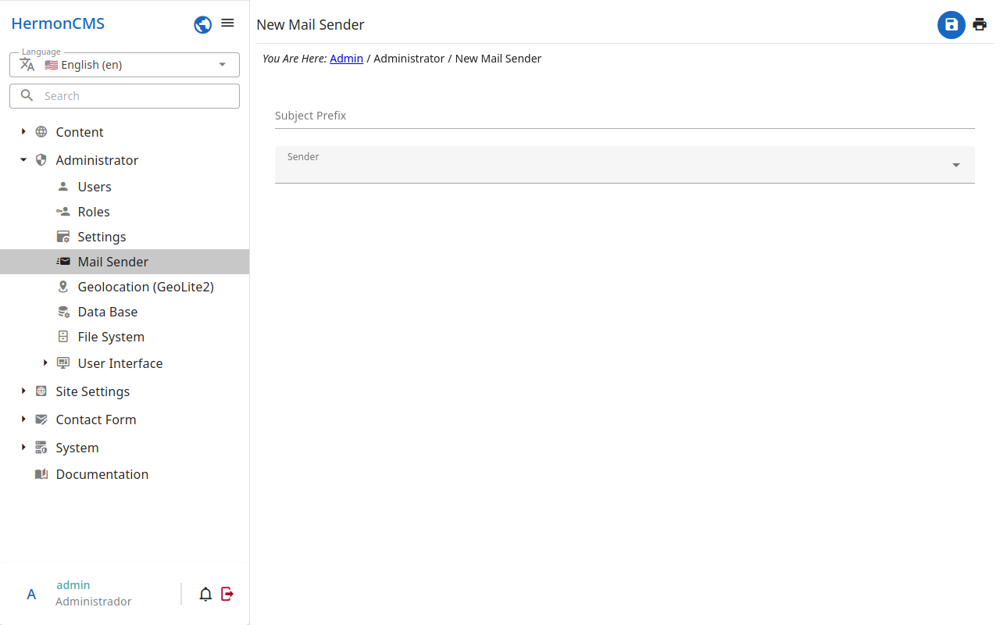

# Mail senders

The accounts the e-mails of the site are sent through — the messages of the
contact form, the password resets, the notifications.

- Each sender is an SMTP account (host, port, user and password) or a Gmail
  account authorized with Google.
- The sender marked **default** is the one used when nothing chooses another.
- Check a sender with .
