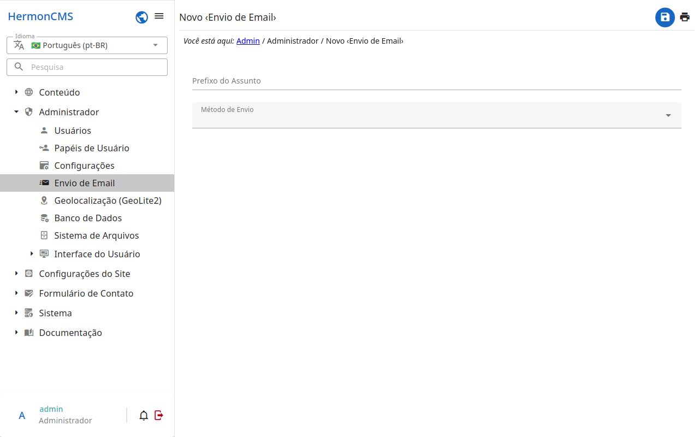

# Remetentes de e-mail

As contas pelas quais os e-mails do site são enviados — as mensagens do
formulário de contato, as redefinições de senha, as notificações.

- Cada remetente é uma conta SMTP (servidor, porta, usuário e senha) ou uma
  conta do Gmail autorizada com o Google.
- O remetente marcado como **padrão** é o usado quando nada escolhe outro.
- Confira um remetente com .
