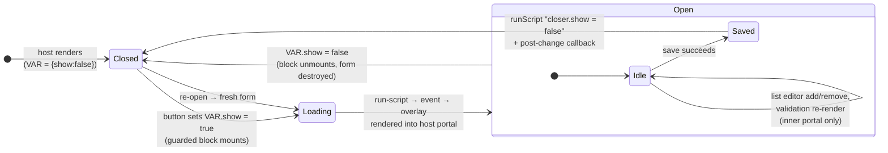
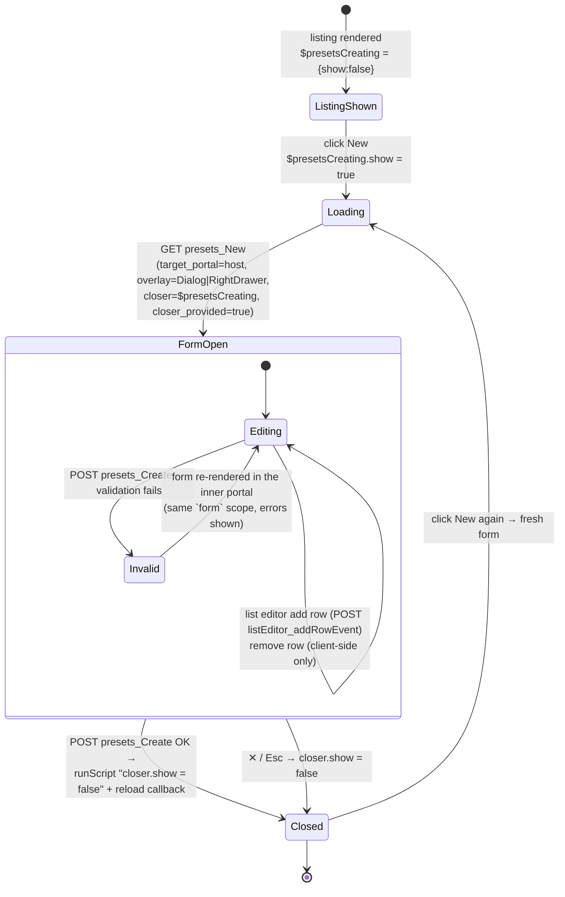
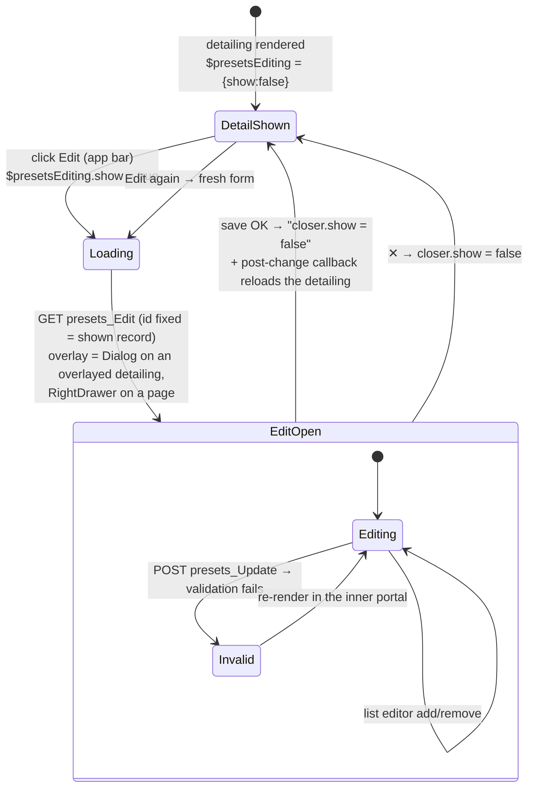
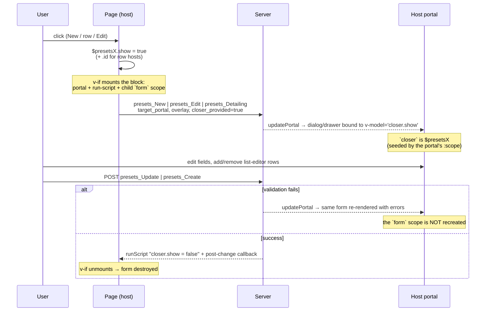

# Form host — opening and destroying edit/create overlays

An edit or create form is an **overlay** (dialog or drawer) that some page opens:
a listing opens *New* and the per-row *Edit*/*Detail*; a detailing opens *Edit*.

The page is the **host** of that overlay. It declares one reactive variable that
*is* the overlay's `closer`, and guards the overlay's block with it:

```html
<user-component :scope='{$presetsEditing: {show:false}}'>
  <template v-slot='{$presetsEditing}'>

    … the opener (its Edit button only does `$presetsEditing.show = true`) …

    <go-plaid-scope v-if='$presetsEditing?.show' v-slot='{ form }' :form='[{}]'>
      <go-plaid-portal portal-name='<uid>' :scope='{"closer": $presetsEditing}'/>
      <go-plaid-run-script :script='plaid()…eventFunc("presets_Edit")
          .query("target_portal","<uid>")
          .scope({closer: $presetsEditing})
          .query("presets_closer_provided","true").go()'/>
    </go-plaid-scope>

  </template>
</user-component>
```

Everything follows from that one variable:

| `VAR.show` | Effect |
| --- | --- |
| `= true` | the guarded block mounts → its run-script loads the form into the host portal → the overlay appears. **One request.** |
| `= false` | the block unmounts → the overlay, the form and its `form` scope are destroyed. No state survives. |
| `= true` again | the block mounts again → a **fresh** form is loaded. |

Built by [`FormHost`](../form_host.go). The scope variables:

| Constant | Variable | Hosted by | Opens |
| --- | --- | --- | --- |
| `DetailingEditScope` | `$presetsEditing` | detailing (event and page) | the edit form of the shown record |
| `ListingNewScope` | `$presetsCreating` | listing | the create form |
| `ListingItemEditScope` | `$presetsItemEditing` | listing | the edit form of a row (`.id`) |
| `ListingItemDetailScope` | `$presetsItemDetailing` | listing | the detailing of a row (`.id`) |

Two design points that are easy to get wrong:

- **The state is a SLOT variable, not app-global `vars`.** This is what allows
  several hosts to be alive at once — the listing on the page, a nested list
  opened in a dialog, and from THAT list a record's detail. Each render declares
  its own variable, so its guarded block is watched by that render alone. On
  `vars` they would all declare the same well-known name and guard their block
  with `v-if` on it, and opening one would mount every one of them: several
  requests, and the overlay rendered into portals nobody is looking at. The
  `$presets` prefix keeps the names out of the application's own namespace.
- **A host wraps whatever holds its opener.** In an event the opener is inline in
  the content, so the host wraps the content and everything inside can drive the
  overlay. On a **page** the primary action is rendered by the LAYOUT into the app
  bar — *outside* the content — so there the host wraps the BUTTON instead:
  variable, guarded block and opener travel together (`WrapsOpener`). Buttons
  outside that wrapper cannot see the variable; they get the reference from the
  host (see [Your own buttons](#your-own-buttons)).
- **The overlay must not create its own closer.** The host seeds `closer` in the
  portal's content scope *and* sends `presets_closer_provided=true`; the
  `Dialog`/`Drawer` responder then binds to that closer instead of wrapping the
  content in a new one (`CloserScope`). Without this, `closer.show = false` on
  save would close a *child* closer, leaving the host on — the form would never
  be destroyed and the button would not re-open it.

## Host lifecycle



`closer` inside the overlay **is** `VAR`: the dialog binds `v-model='closer.show'`
and the save response runs `closer.show = false`, which is what unmounts the
block. Closing by the ✕ button does the same through the same binding.

## NEW, from a listing

The listing renders the `$presetsCreating` host around the New button when its
actions go to the app bar, and around itself when they stay inline in a dialog
(`ListingComponentBuilder.hostForms` / `actionsComponent`); the button carries no
plaid either way.



The `post_change_callback` given to the host is the listing's reload callback, so
a successful create refreshes the table in the same round-trip that closes the
overlay.

## DETAIL / EDIT, from a listing row

The listing renders **one** host per action for the whole table — not one per row.
Each host has an extra `id` variable; the row points it at its record:

```html
<td @click.self='$presetsItemDetailing.id = "42";
                 $presetsItemDetailing.show = true; …'>
```

and the host's run-script loads whatever the variable holds:

```js
plaid()…eventFunc("presets_Detailing").query("id", $presetsItemDetailing.id)…
```

Which host a row uses: `$presetsItemDetailing` when the model has a detailing,
otherwise `$presetsItemEditing` (the row menu's *Edit* always uses the latter).
Outside a listing — a row menu rendered elsewhere — there is no host and the call
site falls back to the self-hosting `presets_EditForm` event (see below).

```mermaid
stateDiagram-v2
    direction TB
    [*] --> ListingShown : hosts rendered:<br/>$presetsItemDetailing / $presetsItemEditing = {show:false, id:null}

    ListingShown --> Loading : click row (or row menu Edit)<br/>VAR.id = "<id>"; VAR.show = true
    Loading --> OverlayOpen : GET presets_Detailing | presets_Edit<br/>query id = VAR.id

    OverlayOpen --> ListingShown : VAR.show = false<br/>(overlay destroyed)
    ListingShown --> Loading : click another row → same host, new id

    state OverlayOpen {
        [*] --> Detail
        Detail --> EditOpen : the DETAILING hosts its own edit form<br/>(see next section)
    }
```



Reusing one host per action means the DOM holds a single overlay portal no matter
how many rows the table has, and opening a second row simply reloads it.

## EDIT, from a detailing

Both detailing entry points host the edit form the same way — the event (overlay)
and the page (`defaultPageFunc`), through `DetailingBuilder.hostedComponent`. They
differ only in WHAT the host wraps: the content on an overlay (the Edit button is
inline in the toolbar), the button itself on a page (the layout renders it into
the app bar):



Because the button only flips a variable, **any** other button on the detailing
can open the same form with `$presetsEditing.show = true` — as long as it is
rendered under the host (on a page, that means under the wrapped action button).

## Round-trip in detail



## Re-renders inside an open overlay

While the overlay is open, the server re-renders **only the inner portal**. The
host's `form` scope is created once, by the host, so it survives every re-render —
which is what keeps the reactive form intact:

| Interaction | Request | What is re-rendered |
| --- | --- | --- |
| Validation failure on save | `presets_Update` / `presets_Create` | the whole form, with `Errors` on the offending fields; the reactive `form` keeps the submitted values |
| List editor **add row** | `listEditor_addRowEvent` | the form; the appended row is flagged `__new` and re-seeded by the component setup |
| List editor **remove row** | *(none)* | client-side only: `form["<field>[i].__deleted"] = true`; the row renders as removed (or vanishes, if it was `__new`) and is reconciled on the next submit |
| List editor **sort** | `listEditor_sortEvent` | the form, with the new `__pos` order |

See [list editor & tables](list-editor.md) for the per-item metadata
(`__pos`, `__index`, `__new`, `__deleted`, `__present`).

That is why the `form` scope belongs to the host and not to the form: an
add/remove/validation round-trip must not reset the fields the user already
filled in.

## Your own buttons

Anything rendered **inside the host** can drive the overlay by writing to its
variable. No plaid, no portal, no event: just `VAR.show = true|false`. Since the
variable is slot-scoped, ask the host for its reference (the helpers below) when
the button is not obviously under it.

### Open the edit form from an extra button on a detailing

```go
d := mb.Detailing("Name", "Total")

d.Field("Total").ComponentFunc(func(field *presets.FieldContext, ctx *web.EventContext) h.HTMLComponent {
    return h.Div(
        h.Text(fmt.Sprint(field.Value())),
        // a second way into the same edit form
        VBtn("Corrigir total").
            Variant(VariantText).
            // resolves to `$presetsEditing.show = true` under this detailing
            Attr("@click", presets.GetDetailingEditHost(ctx).ShowExprOr(presets.DetailingEditScope)),
    )
})
```

### Close it from inside the form

The form is rendered with `closer` bound to the host's variable, so inside the
overlay both spellings work:

```go
// inside an editing field / action of the same model
VBtn("Cancelar").Attr("@click", "closer.show = false")
// … identical to, under the detailing that hosts it:
VBtn("Cancelar").Attr("@click", presets.DetailingEditScope+".show = false")
```

### Open a row's edit form from a custom listing action

Per-item hosts also take the record id. Use the published hosts so the expression
matches whatever the listing rendered (and degrade gracefully when there is none):

```go
l.RowMenu().SetRowMenuItem("Editar total").ComponentFunc(
    func(rctx *presets.RecordMenuItemContext) h.HTMLComponent {
        open := presets.GetItemFormHosts(rctx.Ctx).OpenEditExpr(rctx.ID)
        if open == "" { // rendered outside a listing: no host to drive
            open = web.Plaid().
                EventFunc(actions.EditForm).
                Query(presets.ParamID, rctx.ID).
                Go()
        }

        return VListItem(VListItemTitle(h.Text("Editar total"))).Attr("@click", open)
    })
```

`OpenEditExpr("42")` produces
`$presetsItemEditing.id = "42"; $presetsItemEditing.show = true`.

### Open the create form from anywhere in a listing

```go
l.NewButtonFunc(func(ctx *web.EventContext) h.HTMLComponent {
    open := presets.GetItemFormHosts(ctx).OpenNewExpr() // "$presetsCreating.show = true"
    return VBtn("Novo produto").
        Color("primary").
        Attr("@click", open)
})
```

The listing's action buttons are wrapped by the create host when they leave for
the app bar, so a button returned here is under it either way.

```go
```

### Toggle, or react to the state

The variable is plain reactive state, so it can also be read:

```go
// toggle
VBtn("").Attr("@click", "$presetsEditing.show = !$presetsEditing.show")

// disable something while the form is open
VBtn("Excluir").Attr(":disabled", "$presetsEditing?.show")
```

Use `?.` when reading in a place that may render before the host assigns its
state; writing (`… .show = true`) happens on click, when the state already exists.

## Callers that cannot host the form

A row menu rendered outside a listing, an action button somewhere else, and other
subsystems (publish, l10n, model_select, pagebuilder) cannot render a host around
themselves. They use the **self-hosting events** `presets_EditForm` /
`presets_NewForm`, which respond with a `FormHost` that is already on
(`Show(true)`): it mounts, loads the form immediately, and behaves exactly like a
page-hosted one from then on. The only difference is one extra round-trip — the
wrapper response — which is precisely what page hosts avoid.

## API

```go
// host a form around the content that holds its opener:
host := presets.FormHost(presets.DetailingEditScope, portal,
    web.Plaid().URL(url).EventFunc(actions.Edit).Query(presets.ParamID, id)…)

comp := host.Children(content).Component()

// a button under it opens it:
btn.Attr("@click", host.ShowExpr()) // "$presetsEditing.show = true"
```

| Method | Purpose |
| --- | --- |
| `Show(bool)` | initial state; `true` makes the host self-opening |
| `Var(name, init)` | extra reactive variable (e.g. `id`), readable by the load event |
| `WrapsOpener(bool)` | this host wraps its BUTTON, not the content — for actions the layout renders into the app bar |
| `Ref()` | the JS expression for the host state (`$presetsEditing`) |
| `ShowExpr()` / `ShowExprOr(scope)` / `OpenExpr(vars)` | what a button runs to open it (`ShowExprOr` is nil-safe) |
| `Children(...)` | what is rendered inside the host |
| `FormHosts(children, hosts...)` | declare SEVERAL hosts in one component |

**Never nest one host inside another in the same response.** A host renders a
`<template v-slot>`, and one nested directly in another is not compiled by the
runtime template parser — the content inside would render inert. Declare them
together with `FormHosts`, which emits a single component with all the
variables; that is how a listing carries its item and create hosts. Separate
*responses* are free to nest (a portal body is compiled on its own), which is
what makes a dialog inside a page work.

Because the names are slot variables, a component cannot hardcode them — it asks
the host. Listings publish theirs with `WithItemFormHosts` / `GetItemFormHosts`
(`OpenEditExpr(id)`, `OpenDetailExpr(id)`, `OpenNewExpr()`), and a detailing
publishes its edit host with `WithDetailingEditHost` / `GetDetailingEditHost`.
They return `""`/`nil` outside a host, so the caller can fall back to the
self-hosting events.

Related: [`ParamCloserProvided`](../const.go), `DialogBuilder.SetCloserProvided`,
`Drawer.SetCloserProvided`.
