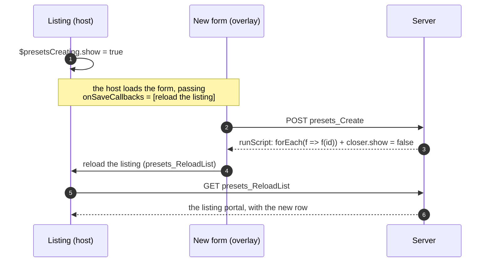
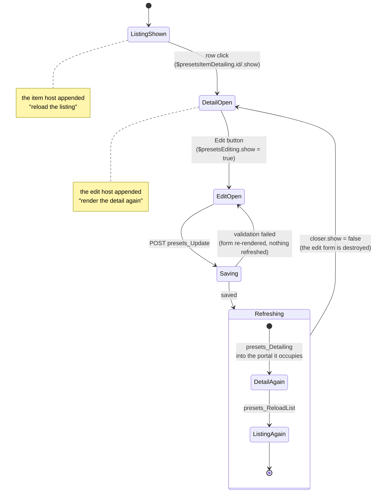
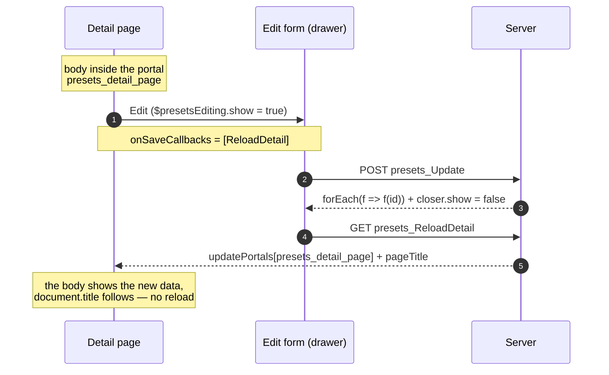
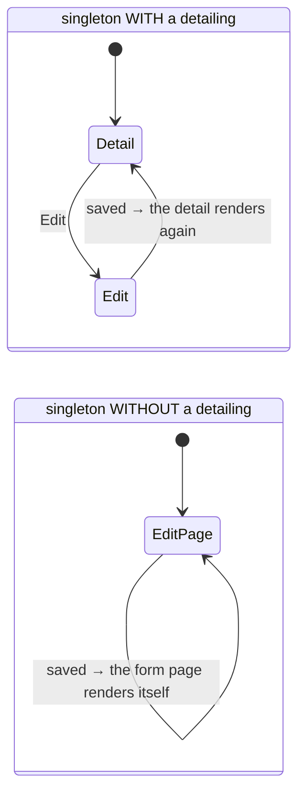

# Post-save refresh — showing a change where it is visible

When a form saves successfully, whatever was showing that record must show the
change. Nothing else is touched, and **the page is never reloaded**.

The saved form does not know who opened it, and carries nothing about it in its
request. It ends by running the hooks in **`onSaveCallbacks`** — a list that
travels down the scope like `closer` and `form`, which every
[form host](form-host.md) extends before passing it on:

```
scope of the page/listing        onSaveCallbacks = []
  └─ listing's host portal       onSaveCallbacks = [reload the listing]
       └─ detailing loaded in it onSaveCallbacks = [reload the listing]
            └─ its edit host     onSaveCallbacks = [reload the listing, render the detail again]
                 └─ the EDIT form  ⟶ save ⟶ runs both, in order
```

The response of a successful `presets_Update` / `presets_Create` ends with

```js
(onSaveCallbacks || []).forEach(f => f("<saved id>"))
```

which is all the coupling there is. A form opened by something that is not a
form host finds an empty list and refreshes nothing — never an error.

## Who refreshes what

| Flow | What is refreshed |
| --- | --- |
| listing → **NEW** → save | the listing |
| listing → row **EDIT** → save (model without a detailing) | the listing |
| listing → row **DETAIL** → **EDIT** → save | the detail, and the listing that opened it |
| **DETAIL as a page** → **EDIT** → save | the detail body and the document `<title>` |
| **SINGLETON** with a detailing → **EDIT** → save | the detail |
| **SINGLETON** without a detailing | the edit form is the page; it renders itself |

Two consequences worth stating, because they are rules and not accidents:

- **A detailing is not always opened from a listing.** It refreshes itself in the
  portal it already occupies, so it does not depend on its opener. If a listing
  DID open it, that listing's own hook is already in the list — and only that
  listing, never every listing on screen.
- **A detailing page refreshes without a page reload.** Its body sits in the
  `presets_detail_page` portal; `presets_ReloadDetail` re-renders it and answers
  with the record's current title, which the client writes into `<title>`.

## NEW, from a listing



## EDIT from a DETAIL opened by a listing



The row click must reach the item host even after the listing reloaded its
table (a NEW, a search, a page change). The reloaded table is sent on its own to
the table portal, and content a portal receives is compiled against the portal's
scope alone. The hosts' slot variables do not reach it, and a `$`-named key of
component state never reaches a template. So the table portal carries each
slot host under a plain alias (`ItemFormHosts.PortalScope`), and the reloaded
table declares them again under their real names (`ItemFormHosts.Rebind`, applied
by `GetTableComponents` when no listing Build published the hosts). Without this
the row falls back to the self-hosting event in the Temp portal. The detail still
opens, but it lost the listing's hook, so saving refreshes only the detail.

## EDIT from a DETAIL page (no reload)



## A listing that is a PAGE

A listing opened in a dialog keeps its overlays in its own portals, and the
`onSaveCallbacks` a host extended reaches the form through the portal's scope.
A listing that is a PAGE sends its overlays to the LAYOUT's portal instead (so a
drawer sizes itself against the window): there the ambient `onSaveCallbacks` is
the root's empty list, and the form reaches the host only by reference —
`vars.$presetsEditing`, sent as `presets_closer_ref`.

So the host's list travels WITH its state: `$closer({…, onSaveCallbacks: [...]})`
carries the list the host extended, and a drawer bound to a closer by reference
exposes `<ref>.onSaveCallbacks` to what it holds. Without it a save in a page
listing refreshed nothing — neither the listing nor the detail that opened the
form. `page_listing.dom.test.ts` pins NEW, the row's EDIT and DETAIL → EDIT on a
page.

## SINGLETON



## Writing your own refresh

A host declares what it refreshes with `OnSave`, in its own template — the place
that knows what the change affects:

```go
host := presets.FormHost(presets.ListingNewScope, portal, loadEvent).
    OnSave(b.reloadURI(ctx)) // JS: runs when a form under this host saves
```

Everything under it — the form, a detailing loaded into it, an edit form opened
from that detailing — inherits the hook and adds its own. To refresh something of
your own after any save under a host, append to the list the same way:

```go
// inside a component rendered under the host
h.Div().Attr(":scope", "{onSaveCallbacks: [...onSaveCallbacks, (id) => { myPortalReload() }]}")
```

Related: [Form host](form-host.md) (how overlays are opened and destroyed),
`presets.PostSaveScript`, `DetailingBuilder.reloadDetail`,
`presets.DetailPagePortalName`.
