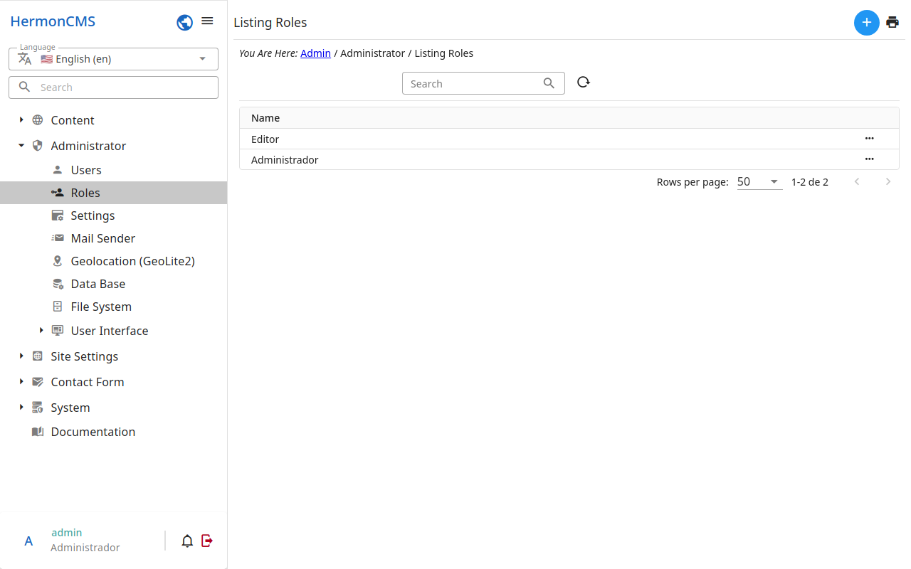

# Roles

A role is a set of permissions: what its users may see and do in the admin.
A user has one or more roles (see ).

- The role **Administrator** may do everything.
- Make a role for each kind of work — editing the site, answering the
  contact form… — and give it only what that work needs.
