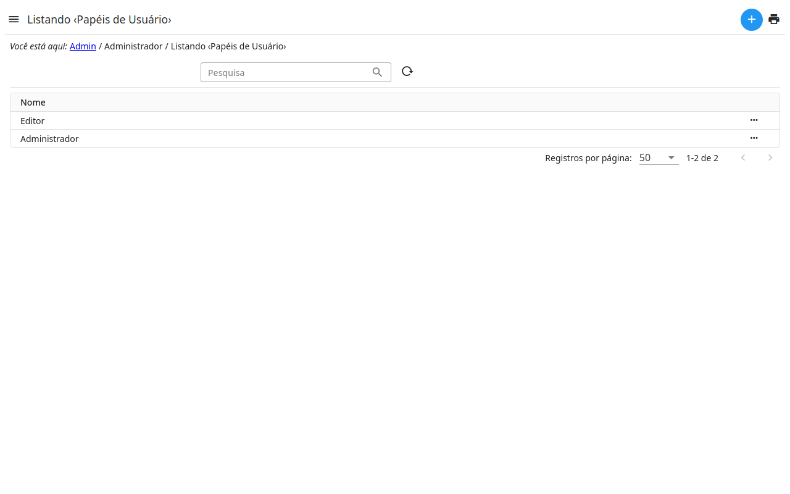

# Papéis

Um papel é um conjunto de permissões: o que seus usuários podem ver e fazer
no admin. Um usuário tem um ou mais papéis (veja
).

- O papel **Administrador** pode fazer tudo.
- Crie um papel para cada tipo de trabalho — editar o site, responder ao
  formulário de contato… — e dê a ele só o que esse trabalho precisa.

## Papéis do sistema

Alguns papéis são do **sistema**: a aplicação precisa deles, e os cria
sozinha quando faltam — a listagem e o detalhe dizem *Papel do sistema* e
para que cada um serve.

- Um papel do sistema **não é excluído** nem **renomeado**.
- As **permissões** dele podem ser mudadas como as de qualquer papel, e
  voltam às originais com a ação **Restaurar as permissões**, no detalhe.
- Um papel do sistema cujas permissões são as do próprio sistema — o
  **Administrador**, que pode tudo — não tem permissões para mudar.
- Um papel de mesmo nome que já existia passa a ser o do sistema: as
  permissões dele são mantidas, e as originais que lhe faltam, somadas.
