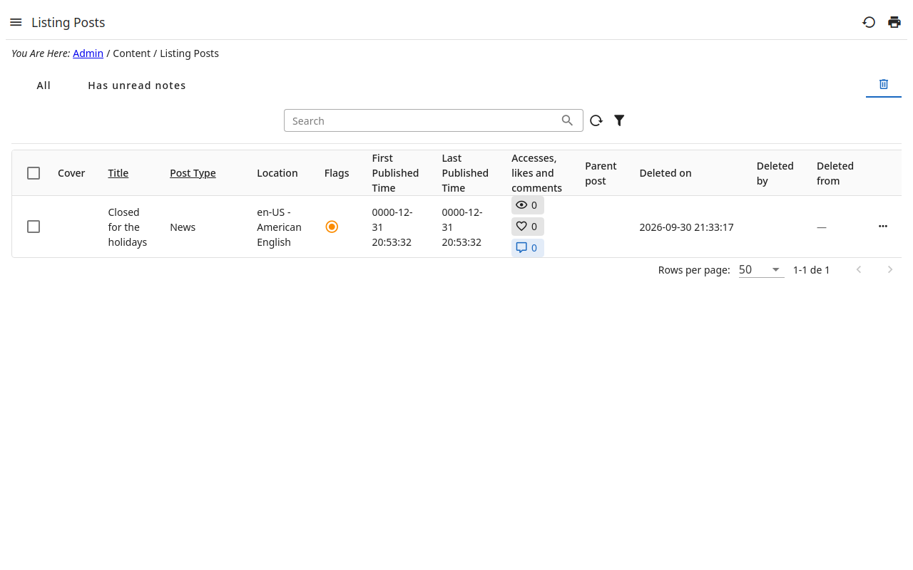

# 2. The trash

A record deleted from a listing is not gone: it goes to the **trash** of the
listing — the tab with the bin, on the right —, with who deleted it, when and
from where.

In the trash a record is **read only**:

- it is not edited — its detail has no edit button, its sections no editing —
  nor deleted again;
- none of its actions runs but those made for the trash:
  , which brings it back, and
  ;
- the bar of the trash offers only **Restore** — no new record, no other
  action —, and the menu of a row (**⋯**) only what is inside the record
  (revisions, comments…) and its pages, to look at.

The server refuses the same, whatever a page shows. To change a deleted record,
restore it first.

## When it is available

The trash is shown to the roles allowed to see it; the others see no tab.
