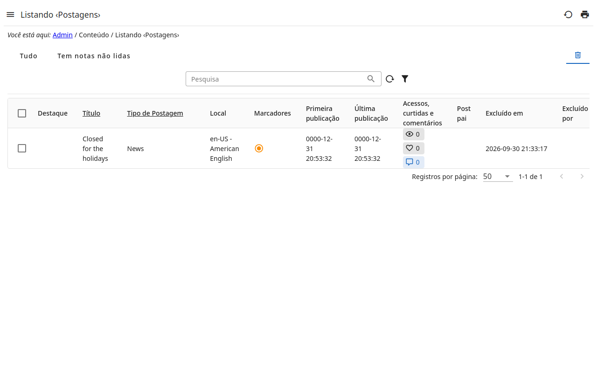

# 2. A lixeira

Um registro excluído de uma listagem não some: vai para a **lixeira** da
listagem — a aba com a lixeira, à direita —, com quem o excluiu, quando e de
onde.

Na lixeira um registro é **somente leitura**:

- não é editado — o detalhe dele não tem botão de editar, as seções não têm
  edição — nem excluído de novo;
- nenhuma ação dele é executada, exceto as feitas para a lixeira:
  , que o traz de volta, e
  ;
- a barra da lixeira oferece só **Restaurar** — nenhum novo registro, nenhuma
  outra ação —, e o menu de uma linha (**⋯**) só o que está dentro do registro
  (revisões, comentários…) e as páginas dele, para consultar.

O servidor recusa o mesmo, mostre a página o que mostrar. Para alterar um
registro excluído, restaure-o antes.

## Quando está disponível

A lixeira aparece para os papéis com permissão para vê-la; os outros não veem
a aba.
