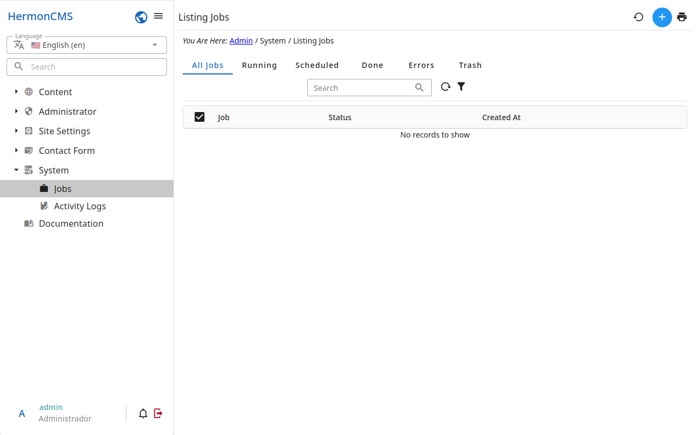

# Jobs

The work the admin does in the background — backups, translations,
downloads — so the page does not wait for it.

- A job has a **status**: new, running, done, failed or killed.
- Open a job to follow its **progress** and its **log**.
- A job running may be stopped; a failed one may be run again.
