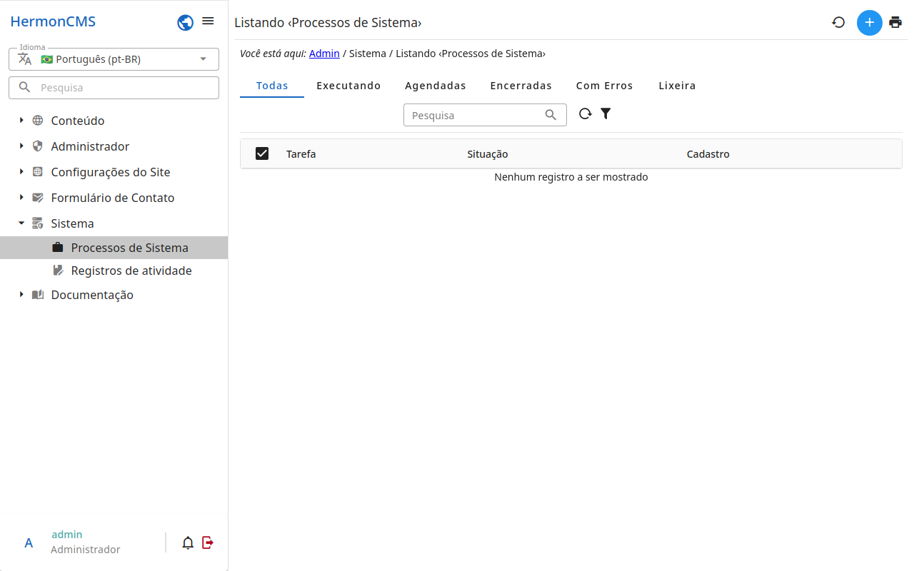

# Tarefas

O trabalho que o admin faz em segundo plano — cópias de segurança,
traduções, downloads — para que a página não precise esperar por ele.

- Uma tarefa tem um **status**: nova, em execução, concluída, com falha ou
  interrompida.
- Abra uma tarefa para acompanhar o **progresso** e o **log** dela.
- Uma tarefa em execução pode ser parada; uma com falha pode ser executada
  de novo.
